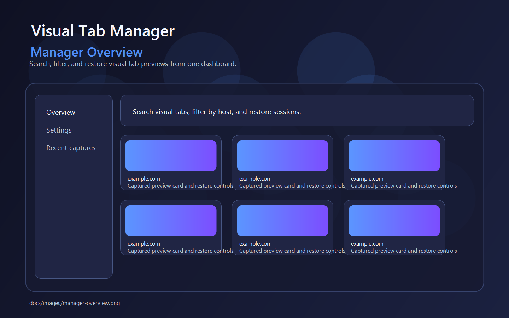

# <sub></sub> Visual Tab Manager

#### Visual tab switching for Firefox with captured page-element previews.



Visual Tab Manager is a Firefox-first WebExtension that captures a chosen page element for each site, keeps local preview thumbnails, and opens a dedicated manager UI for browsing, restoring, and organizing tabs visually.

## Download

[](https://github.com/Frugd/Visual-Tab-Manager/releases)
[](#package-for-firefox)

<br clear="both">

- GitHub tags and releases should contain only the default source-code archives generated by GitHub.
- If you need a packaged Firefox build, create it locally with `scripts/package-firefox.ps1` or download it from a GitHub Actions run artifact.

## Features

- Visual tab switching with captured page-element previews
- Per-domain CSS selector and title keyword rules
- Manager UI with search, filters, pagination, and settings
- Optional automatic capture after granting all-sites permission
- Local-first storage with IndexedDB and browser storage APIs

## Developing

> Optional tooling: Node.js + npm for repository formatting scripts

1. Clone the repository.
2. Load the extension in Firefox from `src/manifest.json`, or package it first with the Firefox script below.
3. Run the packaging script when you need a distributable Firefox build.

```powershell
powershell -ExecutionPolicy Bypass -File scripts/package-firefox.ps1
```

### Load The Extension In Firefox

1. Open Firefox and go to `about:debugging#/runtime/this-firefox`.
2. Click `Load Temporary Add-on`.
3. Select `src/manifest.json`.

### Package For Firefox

The packaging script creates:

- `dist/firefox/` - staged extension files
- `dist/visual-tab-manager-firefox.zip` - unsigned package for local distribution or AMO signing

These files are build outputs only and stay out of git.

## Repository Layout

- `src/` - main extension source tree, organized closer to `Tab-Session-Manager-master`
- `src/background/` - background service worker logic
- `src/common/` - shared runtime UI helpers
- `src/content/` - picker and auto-capture content scripts
- `src/manager/` - manager interface and settings view
- `src/popup/` - browser action popup
- `src/icons/` - extension icons used by manifests and README
- `other/promotion/` - repository screenshots and lightweight promotional assets
- `release/amo/metadata.template.json` - AMO metadata template
- `scripts/package-firefox.ps1` - Firefox packaging entry point

## Automation

- `.github/workflows/publish-firefox.yml` builds the Firefox package on tags matching `firefox-v*`
- The workflow uploads build outputs as GitHub Actions artifacts
- It does not attach packaged archives to GitHub Releases
- AMO signing runs only when `AMO_JWT_ISSUER` and `AMO_JWT_SECRET` are configured

## Privacy Policy

Visual Tab Manager stores captured thumbnails and settings inside the browser. It does not include analytics, ads, or external data services.

[Privacy Policy](docs/privacy-policy.md)

## License

This project is licensed under the MPL-2.0. See [LICENSE](LICENSE).
